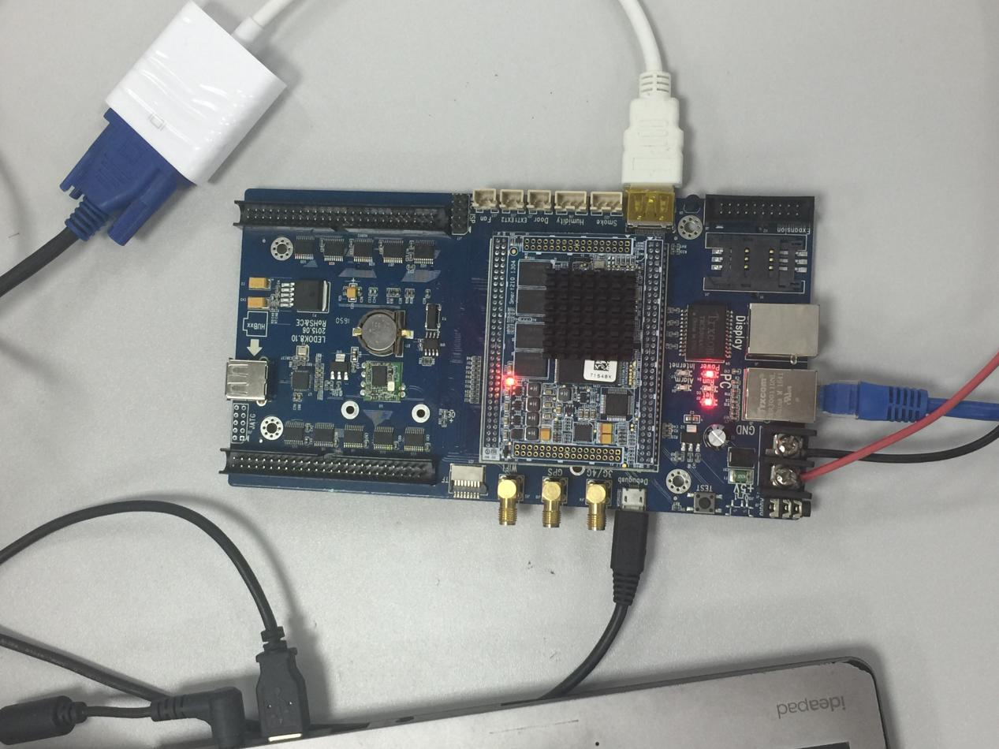
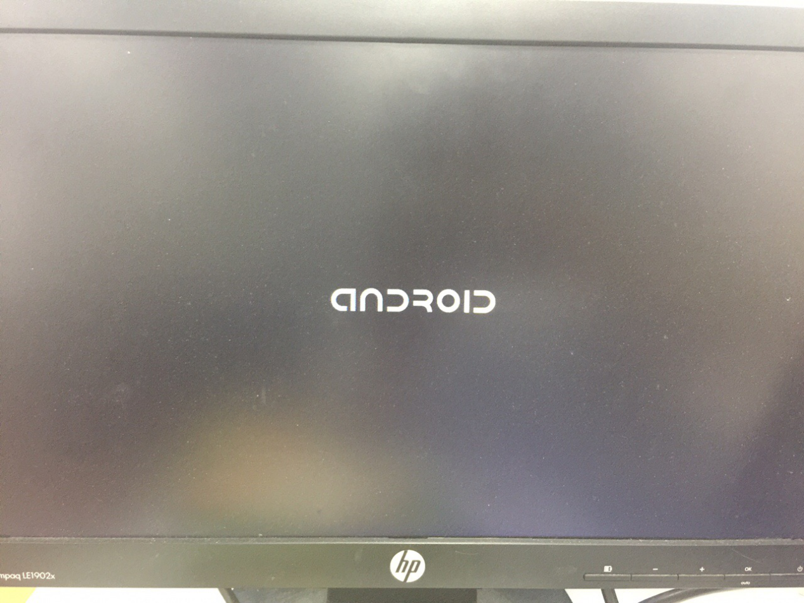
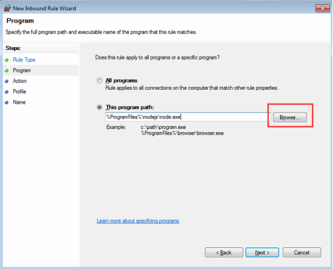
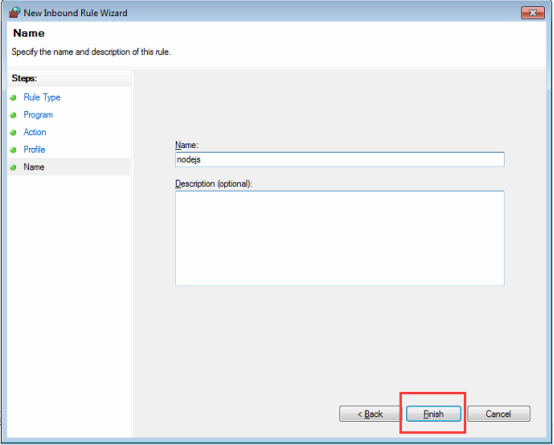
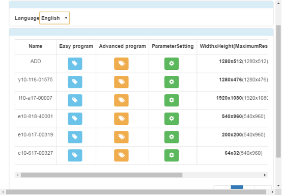
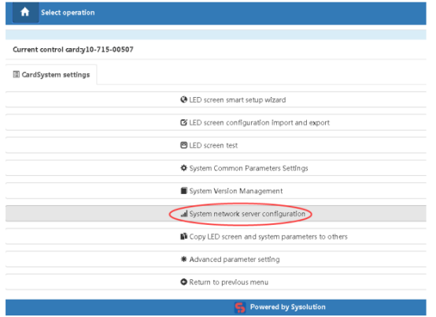
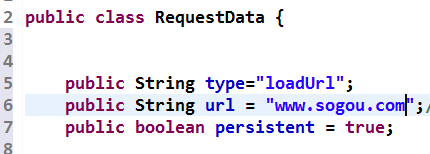
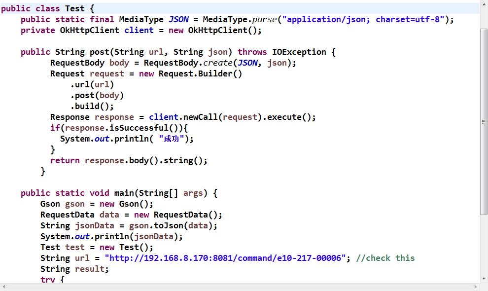
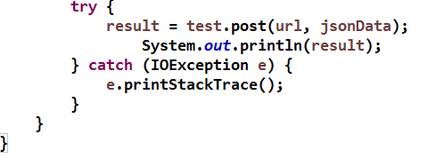

customized development solution for xixun android system controller
==========================

[customized development solution for xixun android system controller ](#熙讯安卓控制卡二次开发方案)

[preparations： ](#开发准备)

[1、 solutions ](#1)

​	[1.1、solution 1 ](#1.1)

​	[1.2、solution 2 ](#1.2)

​	[1.3、solution 3 ](#1.3)

[2、 solutions introductions ](#2)

​	[2.1、Realtime service traits ](#2.1)

​	[2.2、Realtime service diagram ](#2.2)

​	[2.3、Realtime service envrionment build up ](#2.3)

​	[2.3.1、summary ](#2.3.1)

​	[2.3.2、install nodejs ](#2.3.2)

​	[2.3.3、setup service port ](#2.3.3)

​	[2.4、run realtimeServer ](#2.4)

​	[2.5、setup server address for controller ](#2.5)

​	[2.6、modify Realtime port ](#2.6)

[3、Realtime communication data procotols 1.5 ](#3)

​	[3.1、declaration ](#3.1)

​	[3.2、protocols intructions](#3.2)

​	[3.3、data protocols ](#3.3)

​		[3.3.1、Upload top layer web page ](#3.3.1)

​		[3.3.2、Invoke js method in “top layer web page” ](#3.3.2)

​		[3.3.3、Marquee ](#3.3.3)

​		[3.3.4、clear sign, clear top layer web page content ](#3.3.4)

​		[3.3.5、Run xwalk ](#3.3.5)

​		[3.3.6、Upload web page through xwalk ](#[3.3.6)

​		[3.3.7、Invoke js method in web page loaded by xwalk ](#3.3.7)

​		[3.3.8、set background (support this function since xwalk-v1.5.3) ](#3.3.8)

​		[3.3.9、play video list ](#3.3.9)

​		[3.3.10、delete video list(support this function since conn-9.6.0) ](#3.3.10)

​		[3.3.11、Pause video (support since conn-9.6.0) ](#3.3.11)

​		[3.3.12、Continue play video(support since conn-9.6.0) ](#3.3.12)

​		[3.3.13、Play video on demand(support since conn-9.6.0)](#3.3.13)

​		[3.3.14、 Display programs downloaded from AIPS(from xixunplayer-v9.9.0) ](#3.3.14)

​		[3.3.15、display streaming address（support rtmp，rtsp protocol, install live first）(from conn-v9.6.9)-](#3.3.15)

​		[3.3.17、Upload and save files like  html﹑image and etc through character string to sd card ](#3.3.17)

​		[3.3.18、Delete files uploaded through character string format ](#3.3.18)

​		[3.3.19、Download files to sd card (random files like images, videos ) ](#3.3.19)

​		[3.3.20、Delete files from sd card ](#3.3.20)

​		[3.3.21、Get file size in sd card ](#3.3.21)

​		[3.3.22、Stop default player (xixunplayer) ](#3.3.22)

​		[3.3.23、Download file to internal storage (images, videos and other files) (from conn-v9.8.1)  ](#3.3.23)

​		[3.3.24、Delete files from internal storage(from conn-v9.8.1) ](#3.3.24)

​		[3.3.25、Upload and save html, images and other files to internal storage via character string format (from conn-v9.8.1) ](#3.3.25)

​		[3.3.26、Check file size of internal storage(from conn-v9.8.4) ](#3.3.26)

​		[3.3.27、Get screenshot(from conn-v9.3.7)](#3.3.27)

​		[3.3.28、.Get Gps location(from conn-v9.3.7) ](#3.3.28)

​		[3.3.29、Switch screen(from conn-v9.3.7) ](#3.3.29)

​		[3.3.30、Query screen status(from conn-v9.3.7) ](#3.3.30)

​		[3.3.31、set brightness(from conn-v9.3.7)](#3.3.31)

​		[3.3.32、get brightness(from conn-v9.3.7) ](#3.3.32)

​		[3.3.33、set volume(from conn-v9.3.7) ](#3.3.33)

​		[3.3.34、get volume(from conn-v9.3.7) ](#3.3.34)

​		[3.3.35、get screen width pixels(from conn-v9.3.7) ](#3.3.35)

​		[3.3.36、get screen height pixels(from conn-v9.3.7) ](#3.3.36)

​		[3.3.37、get network type(from conn-v9.3.7) ](#3.3.37)

​		[3.3.38、Set NTP server or time zone (from conn-v9.3.7) ](#3.3.38)

​		[3.3.39、Get NTP server(from conn-v9.3.7) ](#3.3.39)

​		[3.3.40、get timezone(from conn-v9.3.7) ](#3.3.40)

​		[3.3.41、reboot(from conn-v9.3.7) ](#3.3.41)

​		[3.3.42、get apk version(from conn-v9.3.7) ](#3.3.42)

​		[3.3.43、get hardware version(from conn-v9.6.4) ](#3.3.43)

​		[3.3.44、interface of update app online (conn10.0.5T or above) ](#3.3.44)

​		[3.3.45、interface of advance parameters setup (conn10.0.5T or above) ](#3.3.45)

​		[3.3.46、interface of synchronous time setup(conn10.0.5T or above) ](#3.3.46)

​		[3.3.47、setup auto brightness, brightness will auto adjust according to sensor data(conn10.0.5T or above) ](#3.3.47)

​		[3.3.48、query auto brightness (conn10.0.5T or above) ](#3.3.48)

​		[3.3.49、brightness schedule, switch to various brightness value according to schedule time segment(conn10.0.5T or above) ](#3.3.49)

​		[3.3.50、query brightness schedule's interface(conn10.0.5T or above) ](#3.3.50)

​		[3.3.51、setup screen switch schedule's interface(conn10.0.5Tor above) ](#3.3.51)

​		[3.3.52、query screen switch schedule (conn10.0.5Tor above) ](#3.3.52)

​		[3.3.53、reboot schedule's interface(conn10.0.5Tor above) ](#3.3.53)

​		[3.3.54、query reboot schedule time (conn10.0.5Tor above) ](#3.3.54)

​		[3.3.55、delete xixunplayer data and file(conn10.0.5Tor above) ](#3.3.55)

​		[3.3.56、get sensor data's interface(conn10.0.0or above) ](#3.3.56)

​		[3.3.57、query controller current time(conn10.0.9or above) ](#3.3.57)

​		[3.3.58、query controller disk storage(conn10.0.9or above) ](#3.3.58)

​		[3.3.59、query current stored program in xixunplayer JSON(conn10.0.9or above) ](#3.3.59)

​		[3.3.60、query current display program name from xixunplayer(conn10.0.9or above) ](#3.3.60)


​	[3.4、Built-in JS method for “top layer web page” ](#3.4)

​	[3.5、Built-in JS method for Xwalk web page](#3.5)

[4、 demonstration for solution 2 ](#4)

​	[4.1、upload webpage by top layer](#4.1)

​		[4.1.1run Realtime Server（already talked in above） ](#4.1.1)

​		[4.1.2、set Realtime server address in controller](#4.1.2)

​		[4.1.3、codes](#4.1.3)

prepare：
==========

1.please prepare following hardware for development and debug:

-   xixun android system controller

-   windows system computer or laptop

-   sample led modules or sample led screen

-   5v power supply

-   Ethernet cables

Hardware connection



2. When controller start to work, will see following message on desktop：



3. NOTES：

-   Make sure IP address of controller and computer in the same network segment

-   Power supply  is 5V DC and do not plug wrong power port。

-   Net and power turn on, Run flashing regular, means controller works normal

<a name="1"></a>

# 1、 customized development solutions

<a name="1.1"></a>

## 1.1、solution 1

Develop Android APK directly, this is the most flexible way to do it. It needs “Card System interfaces” for certain function. (Check “xixun_card_setting.zip” for further details).

Necessary Preparation:

-    At least one Android programming language.(JAVA, Kotlin, Scala etc.)

-   Basic related Android knowledge. (Activity, Service, BroadcastReceiver, etc.)

<a name="1.2"></a>

## 1.2、solution 2

Developing with WEB technology and HTTP communication based on RealtimeSDK that provided by Xixun Company, it is a faster way although have some limit to realize certain functions. 

Necessary Preparation：

-   know html+css

-   master at JavaScript

-   At least one back-end develop language (C#, JAVA, PHP, nodejs, etc.)

<a name="1.3"></a>

## 1.3、solutin 3

On the basis of **solution 2**, implement WebSocketServer itself (to replace the RealtimeServer in RealtimeSDK)

Necessary Preparation:

-   know html+css

-   master at JavaScript

-   l At least one back-end develop language (C#, JAVA, PHP, nodejs, etc.)

substitude mode：

- For users who want to replace RealtimeServer（ to realize websocket server by themselves）please learn and know following communication:  
  1. android customer side, when（websocket client)connecting to websocket server will send controller serial id, data is JSON character string {"cardId":"y10-xxxxx"}。  

  2. websocket server send the JSON data (and replenish a id field stands for command data ID ) in the following "data protocols" then will get corresponde answer from websocket client .

   For Instance: websocket server sends JSON data  

    ```json
    { 
        "_id":"001", 		//unqiue ID of data
        "type":"loadUrl",
        "url":"http://www.m2mled.net/ex2015/index_en.html",
        "persistent": true 	//persistance, auto upload url after reboot
    }_
    ```


    will receive JSON data from websocket client
    
    ```json
    {"_id":"001","_type":"success"}
    ```
    
    _type	is enumertate character string, has following possible values: 
    success 	
    error     	will return with message when error, for instance:
    
    ```
    {"_id":"001","_type":"error","message":"xxxxx"} 
    ```
    
    restart 	client side first start after power on or means restart
    pause 	clinet side screen was quit, but will only appear this value when plug mouse in controller and right click mouse

<a name="2"></a>
# 2、solutions instructions


-   The document focuses on how to use Realtime server solution to do customized development 

<a name="2.1"></a>

## 2.1、Realtime traits 


-   Realtime protocol ‘s data format is JSON character string, which has smaller data size and also easier to use comparing to that of XML. Moreover, almost all types of programming languages provide to library for JSON serialization and deserialization.

-   Adopts  web standard for display interface, support html5. As long as know how to use html and css then can define all types of  layouts and styles, to change display content with javascript. 

-   Controller adopts passive receiving command type, sending Realtime data command when need display or change content, send and display without delay, save time and 3g data flow.

-   Just need send 2 types of command data: **loadUrl** and **callFnInLoaded** then can display all types of content like images, texts and videos. 

-   In conclusion, it would be a more simple and faster way to use Realtime protocol to do customized development. 

<a name="2.2"></a>
## 2.2、Realtime server diagram


<a name="2.3"></a>
## 2.3、Realtime server environment buildup

<a name="2.3.1"></a>
### 2.3.1、summary

-   This solution only workable for users who have knowledge of web technology, can visit any website by using loadUrl interface,Provide invokeJs to call javascript method in current webpage (can transfer text data via this method) to realize real time display, users can customize define display interface and logic.

>   **Principle:** controller connects to realtimeServer software（this software running based on nodejs） through network, then users web system or other types software post specific format of data via http protocol to realtimeServer then realize display in real time. 

- > 

### 2.3.2、install nodejs

-   Install the correct nodejs according to the Server operation system, download link: http://nodejs.org/download/. The SDK contains the application for windows 64bit and 32bit system. 
    <a name="2.3.3"></a>
### 2.3.3、open server port

-   windows system： open Control Panel, choose Windows Firewall, select “Advanced setup”, choose “inbound rules”, then choose “Add new rule’ on the right side of the window, choose “Program” and Next, 


-   Please write down or select the path of node.exe, the default path name is C:\Program Files\nodejs\node.exe and then press Next,
  
    For last step, can choose nodejs for the name, press Finish. 






<a name="2.4"></a>

## 2.4、Run realtimeServer


-   windows system：press Shift key meanwhile right click “RealtimeServer” folder in SDK, then choose “Open command window here” and input node bin\www


<a name="2.5"></a>
## 2.5、Set server address for controller


-   l Unzip the EasyBoard.zip file and install Easyboard software. After it detected the Y10 card, please enter Parameter settings, password is 888. 



-   l Then go to “System network server configuration”。



-   Input the Realtime server’s  host computer’s IP and port (8081 is default port) and SAVE.。


-   When see tip message saying Good Job, means save success. 


<a name="2.6"></a>

## 2.6、modify Realtime port


-   If want to modify monitor port for realtime server, please go to directory of realtimeServer and open config.js file by text editor and then change 8081 into new port number and then set terminal restart notification. Please refer to explanation of restartNotification.

<a name="3"></a>

# 3、Realtime communication protocol 1.5


<a name="3.1"></a>
## 3.1、Declaration

### **Dear all,** 

### **This is a totally free data protocol we prepared for all customers who want to do customized development, please READ this document carefully;**

### **This is a very complete and simple protocol, so we trust that all programmers with web development technology or android development technology will be no problem to complete their work;**

### **In order to ensure the quality of our project and more time to fulfill our own work, xixun company will not provide any more free technical support;** 

### **When you met problems during your development, please read more books and learn by yourself, also can send emails to** [wh@xixunled.com ,](mailto:wh@xixunled.com ,) **we will reply when have time.** **Enjoy your time and have fun!**

<a name="3.2"></a>

## 3.2、protocols instructions


-   **Before adopting this data protocol,please r**un RealtimeServer; or refer to source code of webViewServer.js in RealtimeServer, build Websocket Server to manage socket connection by yourself, (using EasyboardV155 software to set  RealtimeServer address , that is Websocket Server address,  **protocol data needs to be added another request filed_id, it is random value, response will also contain this _id).**  RealtimeServer in the SDK will only work for transferring the protocol data, please refer to System.png for the network diagram. 

-   1) RealtimeServer external interface based on the HTTP protocol, so please let your application send following protocol data to RealtimeServer through HTTP protocol and get corresponding results:

-   HOST:means the computer IP address **or domain** **name** which RealtimeServer build on

-   *Port：RealtimeServer port*

-   *Method：POST*

-   *Path：/command/controller serial id（/command/y10-c14-00140)*

-   *Header："Content-Type" value is "application/json; charset=UTF-8"*

-   *Content/Body：data protocol（JSON string）*

<a name="3.3"></a>

## 3.3、data protocol

**This protocols only provide some basic functions. If want to realie some complicated or special program edition and display, please adopts webpage type and refer to upload webpage protocols. **

<a name="3.3.1"></a>

### 3.3.1、Upload top layer web page （will display on the top layer and cover others, default is transparent）

 

```js
{

	"type":"loadUrl",
	"url":"http://www.m2mled.net/ex2015/index_en.html",//url:'file:///mnt/sdcard/test.html, //can be local path either
	"persistent": true 				//persistent, will re-upload url after reboot 

}
```


<a name="3.3.2"></a>
### 3.3.2、Invoke js method in “top layer web page”

**（TIPS: do not add some codes which needs operate by mouse like alert in js, will make controller stuck）**

```js
{ 
	"type": "invokeJs",		//type
	"js":"handleData({id:'m2',content:'how/<br>are/<br>you2222/<br>?',direction:'down'})"
	//invoke opened js method in current web page
} 
```


**precondition：there should be a handleData method (could be any method name) under window object in current web page, example:**

```js
window.handleData = function(data){ 
	console.log(data) 
}
```

<a name="3.3.3"></a>

### 3.3.3、Marquee

```json
{ 
"type": "invokeBuildInJs", //type
"method": "scrollMarquee", //built in js method
"num": 5 , 				// scroll 5 times, attention type is Number, write down 0 will stop scrolling, write down negative numbers will scroll forever
"html": "<i><b style=\"color:blue;\">this is </b>scroll text </i>", 
"interval":50, 			//step interval, unit is millisecond, attention type is Number
"step":1, 				//step distance, unit is pixel, attention type is Number
"direction": "left",	 //scroll to left, can write down value like left﹑right
"align": "top"			 //show in top, can write down value like top、center、bottom
}
```


<a name="3.3.4"></a>
### 3.3.4、Clear sign, clear top layer web page content

```json
{ 
	"type": "clear"
}
```


<a name="3.3.5"></a>
### 3.3.5、Run xwalk

**（need to install xwalk using Easyboard，xwalk is a browser supporting html5 ）** 

```json
{ 
	"type": "startActivity", 
	"apk": "com.xixun.xy.xwalk" 
}
```

<a name="3.3.6"></a>

### 3.3.6、Upload web page through xwalk

**Must use** **《start xwalk》 **command to run xwalk in the first then can contiue to use xwalk uploading webpage. If persistent is true then no need call《start xwalk》 command next time, controller will auto upload last url after reboot; if persistent is false then need cal《start xwalk》**command again to upload webpage.** 

**（TIPS: do not add some codes which needs operate by mouse like alert in js, will make controller stuck**

**solemnly declare：do not use video tag in webpage or the display will stuck after running  a certain long time！）** 

```json
{ 
	"type": "callXwalkFn", 
	"fn": "loadUrl", 
	"arg": { 
		"url":"http://192.168.8.99:808/score.html", 
		"backupUrl":"file:///mnt/sdcard/res/backup.html",*//backup address will load this address when no network,（if not persistant then can omit this url, if url needs port 80, like http://www.codingke.com:80/v/1926-lesson-228-course）* 
		"persistent": true,  *//persistent, will re-upload url after reboot * 
		"extra":{ 			*//extra data(can omit it), its value can be random type, get its value by window.$extra in web page
            "a":1, 
            "b": true,
            "c":"abc"
		} 
	} 
}
```

<a name="3.3.7"></a>

### 3.3.7、Invoke js method in web page loaded by xwalk

```json
{ 
    "type": "callXwalkFn", 
    "fn": "callFnInLoaded", 
	"arg": { 
        "fn": "changeText",						*//this parameter is the data of introduce fn, can be random type
		"arg": { 
            "id":"m2", 
            "content": "/<b>data/</b> in m2"
		} 
	} 
}
```


<a name="3.3.8"></a>
### 3.3.8、set background (support this function since xwalk-v1.5.3)

```json
{ 
    "type": "callXwalkFn", 
    "fn": "setBackgroundColor", 
    "arg":"/#666666" 
}
```

Attention: loaded web page at this moment should be defined showHtml method already

<a name="3.3.9"></a>

### 3.3.9、play video list

**(**support this function since conn-9.6.8, added new property pathList, use relative path, support internal storage for non-y10 card, can use protocol ofdownload file to controller**to download files**)

```json
{ 
    "type":"setPlayList", 
    "list":[ 
        "/data/data/com.xixun.xy.conn/files/local/abc**/test.mp4" 
            ], 
    "pathList":[ 
        "/test.mp4", 
        "/include/video/loop_idle_mp_visual.mp4"
    ], 
    "width":640, 
    "height":200, 
    "top":0, 
    "left":320 
} 
//pathListmeans the path of sd card, its root directory start with**/mnt/sdcard/**
//list is returned absolute path of downloading file to storage
```

<a name="3.3.10"></a>

### 3.3.10、delete vide list(support this function since conn-9.6.0)

```json
{ 
	"type":"clearPlayList"
}
```

<a name="3.3.11"></a>
### 3.3.11、Pause video (support since conn-9.6.0)

```json
{ 
	"type":"pause"
}
```

<a name="3.3.12"></a>
### 3.3.12、 Continue play video(support since conn-9.6.0)

```json
{ 
	"type":"continue"
} 
```


<a name="3.3.13"></a>
### 3.3.13、play video on demand(support since conn-9.6.0)

```json
{ 
	"type":"play", 
	"index": 0 
}
```

<a name="3.3.14"></a>
### 3.3.14、Display programs downloaded from AIPS(from xixunplayer-v9.9.0)

```json
{ 
    "type": "commandXixunPlayer", 
    "command": { 
        "_type": "PlayXixunProgramZip", 
        "path": "/mnt/sdcard/programA.zip", *//absolute path* 
        "password":"abc" 
	} 
}
```

<a name="3.3.15"></a>
### 3.3.15、display streaming address（support rtmp，rtsp protocol, install live first）(from conn-v9.6.9)

```json
{ 
    "type": "callLiveService", 
    "_type": "StartLiveVideo",			 //case sensitivity 
    "url": "rtmp://live.hkstv.hk.lxdns.com/live/hks", 
    "width": 400, 
    "height": 300 
}
```

<a name="3.3.16"></a>

### 3.3.16、stop display streaming address (from conn-v9.6.9)

```json
{ 
    "type": "callLiveService", 
    "_type": "StopLiveVideo" 			//注意大小写 
}
```


<a name="3.3.17"></a>
### 3.3.17、Upload and save files like  html﹑image and etc through character string to sd card

（this protocol works for pushing text data to led control card, support no more than 10MB files; if larger than 10MB, please use “download to sd card”protocol, it works for led control card downloads files from http server, support big size file.） 
save type of binary file:
*//*coding image using base64 (depends on your programming language )

```js
var base64Data=require('fs').readFileSync('./test.jpg',{encoding:'base64'}) 
```

*//*following is protocol data

```json
{ 
    "type": "saveStringFile", 
    "fileName": "img.jpg", 			*//check this* 
    "content": "base64Data", 
    "base64":true
} 
```

save html： 

```json
{ 
    "type": "saveStringFile", 
    "fileName": "demo.html", *//check this* 
    "content":"<html><body><h1>These html can be saved to sdcard</h1></body></html>" 				*//you can load file and put it's string here* 
} 
```


NOTE：all files uploaded by this protocol will be saved to the directory of file:///sdcard/xixun_realtime/, so if no SD card can not use this interface.


<a name="3.3.18"></a>
### 3.3.18、Delete files uploaded through character string format

```json
{ 
    "type": "deleteFile", 
    "fileName": "img.jpg", 		*//check this* 
    "deleteAll": true       *//uncomment this if you want to delete all saved files* 
}
```


<a name="3.3.19"></a>
### 3.3.19、Download files to sd card (random files like images, videos )

```json
{ 
    "type": "downloadFileToSD", 
    "url": "http://localhost:8080/demo.html", 
    "path": "/201505/download.html"//file path after saved , actual absolute path is							file:///mnt/sdcard/201505/download.html 
}
```

<a name="3.3.20"></a>

### 3.3.20、 Delete files from sd card

```json
{ 
    "type": "deleteFileFromSD", 
    "path": "/201505/download.html" 
}
```

<a name="3.3.21"></a>

### 3.3.21、Get file size in sd card

**can check upload(download) success or not by using this protocol**

```json
{ 
    "type": "getFileLength", 
    "path": "/201505/download.html" 
} 
Return:{"length":2560812,"_type":"success"}
```


<a name="3.3.22"></a>
### 3.3.22、Stop default player (xixunplayer)

```json
{ 
    "type": "stopPlayer", 
    "stop": true *// open defaulted player: false* 
}
```


<a name="3.3.23"></a>
### 3.3.23、 Download file to internal storage (images, videos and other files) (from conn-v9.8.1)

```json
{ 
	"type": "downloadFileToLocal", 
	"url": "http://192.168.1.200:8080/demo.html", 
	"path": "/abc/demo.html"//file path of afer save, actual absolute file path is file:///data/data/com.xixun.xy.conn/files/local/abc/demo.html 
} 
Return:
{"_type":"success","absolutePath":"/data/data/com.xixun.xy.conn/files/local/abc/demo.html"}
```

<a name="3.3.24"></a>

### 3.3.24、 Delete files from internal storage(from conn-v9.8.1)

```json
{ 
    "type": "deleteFileFromLocal", 
    "path": "/abc" //can delete whole catalogue
}
```


<a name="3.3.25"></a>
### 3.3.25、Upload and save html, images and other files to internal storage via character string format （same saveStringFile principle with that of Item13 (from conn-v9.8.1)

```json
//already disable
{ 
    "type": "saveStringFileToLocal", 
    "content": "/<html>/</html>", 
    "path": "demo.html", 		*//check this* 
    "base64":false 			//optional,please put true if content value format is BASE64 encoding character string
} 
Return:
{"_type":"success","absolutePath":"/data/data/com.xixun.xy.conn/files/local/demo.html"}
```

<a name="3.3.26"></a>

### 3.3.26、Check file size of internal storage(from conn-v9.8.4)

```json
{ 
	"type": "getLocalFileLength", 
    "path": "/abc/demo.html" 
} 
```


<a name="3.3.27"></a>
### 3.3.27、 Get screenshot(from conn-v9.3.7)

```json
{ 
	"type": "callCardService", 
	"fn": "screenshot", 
	"arg1": 100, 	*//quality* 
	"arg2": 100 	*//scale* 
} 
Return:{"result":"/9j/4AAQSkZJRgABAQAAAQABAAD/...."}screen shot is base 64 encode character string, contains too much \n, need to remove \n with regular then can display out, format is png.）
```


<a name="3.3.28"></a>
### 3.3.28、Get Gps location(from conn-v9.3.7)

```json
{ 
	"type": "getGpsLocation"
} 
Return:{"lat":31.23856585,"lng":121.32834949}
```


<a name="3.3.29"></a>
### 3.3.29、Switch screen(from conn-v9.3.7)

```json
{ 
    "type": "callCardService", 
    "fn": "setScreenOpen",
    "arg1": true 							//true or false** 
} 
Return:{"result":true}
```


<a name="3.3.30"></a>
### 3.3.30、Query screen status (from conn-v9.3.7)

```json
{ 
    "type": "callCardService", 
    "fn": "isScreenOpen" 
} 
Return:{"result":true}
```


<a name="3.3.31"></a>
### 3.3.31、Set brightness(from conn-v9.3.7)

```json
{ 
    "type": "callCardService", 
    "fn": "setBrightness", 
    "arg1": 6 								*//1 to 8* 
} 
Return:{"result":true}
```


<a name="3.3.32"></a>
### 3.3.32、 Get brightness (from conn-v9.3.7)

```json
{ 
    "type": "callCardService", 
    "fn": "getBrightness" 
} 
Return:{"result":6}
```


<a name="3.3.33"></a>
### 3.3.33、Set volume(from conn-v9.3.7)

```json
{ 
    "type": "callCardService", 
    "fn": "setVolume", 
    "arg1": 10 *//0 to 15* 
} 
Return:{"result":true}
```


<a name="3.3.34"></a>
### 3.3.34、Get volume(from conn-v9.3.7)

```json
{ 
    "type": "callCardService", 
    "fn": "getVolume" 
} 
Return:{"result":10}
```


<a name="3.3.35"></a>
### 3.3.35、Get screen width pixel(from conn-v9.3.7)

```json
{ 
    "type": "callCardService", 
    "fn": "getScreenWidth"
} 
Return:{"result":1280}
```


<a name="3.3.36"></a>
### 3.3.36、Get screen height pixel (from conn-v9.3.7)

```json
{ 
    "type": "callCardService", 
    "fn": "getScreenHeight" 
} 
Return:{"result":512}
```


<a name="3.3.37"></a>
### 3.3.37、Get Network type(from conn-v9.3.7)

```json
{ 
    "type": "callCardService", 
    "fn": "getNetworkType" 
} 
Return:{"result":"ETH"}
```


<a name="3.3.38"></a>
### 3.3.38、 Set NTP server or time zone (from conn-v9.3.7)

```json
{ 
    "type": "callCardService", 
    "fn": "setTimeSync", 
    "arg1": "ntp.sjtu.edu.cn", *//ntpServer* 
    "arg2": "Asia/Shanghai" *//timezone* 
} 
Return:{"result":true}
```


<a name="3.3.39"></a>
### 3.3.39、Get NTP server(from conn-v9.3.7)

```json
{ 
    "type": "callCardService", 
    "fn": "getNtpServer" 
} 
Return:{"result":"ntp.sjtu.edu.cn"}
```


<a name="3.3.40"></a>
### 3.3.40、 Get time zone(from conn-v9.3.7)

```json
{ 
    "type": "callCardService", 
    "fn": "getTimezone"
} 
Return:{"result":"Asia/Shanghai"}
```

<a name="3.3.41"></a>

### 3.3.41、reboot (from conn-v9.3.7)

```json
{ 
"type": "callCardService", 
"fn": "reboot", 
"arg1": 1 //*delayForSecond 
} 
Return:{"result":true}
```

<a name="3.3.42"></a>

### 3.3.42、Get APK version(from conn-v9.3.7)

```json
{ 
	"type": "getPackageVersion",  
	"apk": "com.xixun.xy.xwalk"  
}  
Return:{"versionCode":4,"versionName":"1.4","firstInstallTime":1439539769420,"lastUpdateTime":1439539769420,"installLocation":1}
```

<a name="3.3.43"></a>

### 3.3.43、Get hardware information(from conn-v9.6.4)

```json
{ 
    "type": "callCardService", 
    "fn": "getFpgaInfomation"
} 
Return:{"_type":"success","result":[{"externalVoltage2":"0.0V","humidity":"0.0%","externalVoltage1":"0.0V","cardVoltage":"4.52V","smoke":"Normal","version":"a000","temperature":"55.0℃","doorOpened":"Open"}]}
```

<a name="3.3.44"></a>

### 3.3.44、interface of update APP online(conn10.0.5Tor above)

interface JSON format,example：

```json
{
	"type":"updateAPP",
	 //command type fixed at updateAPP, not allow to change
	"appUrl":"https://m2mled.net/file/download?id=5c13839da62960b53cb07b42"
 	//app download address
}
```

success return, example：

```json
{   
    "_type": "success",
    "_id": "448e715c-5c31-4a52-b0ac-18165e4fd9a0",
    "timestamp": 1551866957797
}
```

<a name="3.3.45"></a>

### 3.3.45、interface of advance parameters setup(conn10.0.5T or above)

interface JSON format,example:

```json
{
	"type":"advancedConfig",			//command type fixed
	"serverURL":"www.ledaips.net",		//specfied server address
	"companyId":"xixun",			   //specified company id
	"realtimeURL":"192.168.8.128:8081",	//specified realtime server address
	"usbProgramPwd":"888"			  //setup 888 or default empty
}
```

controller will disconnect before start new connection if setup success, so if not return "not opened" error means success.  

<a name="3.3.46"></a>

### 3.3.46、interface of synchronizie time(conn10.0.5T or above)

interface JSON format, example：

```json
{
    "cardId":"y10-817-01926",	//target controller serial ID
    "type":"setTimeSync",	//command character string is fixed
    "time":"serial",		//can choose serial、gps or ntp, means modem, gps and network time in turn
    "brightness":"none",	//time=“serial”,choose serial,brightness depends on master modem, otherwise set none
    "volume":"none",		//time="serial“，choose serial,volume depends on master modem, otherwise set none
    "screenSwitch":"none",	//time="serial"，choose serial, screen switch depends on master modem, otherwise set none
    "identificationCode":"1",	//identification code，just enable when time=”serial“，devices identification code must be the same if need synchronization
    "delaySync":"1",		//time=”serial" inteval time for synchronous，frequency of specified app to adjust time, unit milliseconds
    "checkNtpTime":""		//time="ntp“inteval time for synchronous，unit minute
}
```

return success data format,example：

```json
{
    "_type": "success",
    "_id": "b2aa241e-c33e-431e-9f0b-1a461b06bf0f",
    "timestamp": 1552296747116
}
```

<a name="3.3.47"></a>

### 3.3.47、setup auto brightness, brightness will auto adjust according to sensor data(conn10.0.5T or above

interface JSON format, example：

```json
{ 
    "type": "setAutoBrightness",
    "sensitivity":"50",		//sensitivity, higher value higher sensitivity
    "minBrightness":"1"	//minimum brightness
}
```

return success data format,example：

```json
{
    "_type": "success",
    "_id": "cb4eee0b-a8e1-47b7-bac0-a7e61a392e28",
    "timestamp": 1553833293474
}
```

<a name="3.3.48"></a>

### 3.3.48、query auto brightness(conn10.0.5T or above)

interface JSON format, example：

```json
{ 
    "type": "getAutoBrightness"
} 
```

return success data format,example：

```json
{
    "_id": "ffb3d0d2-a4ab-4e0f-9b30-01e00c6beef4",
    "_type": "success",
    "sensitivity": 50,
    "minBrightness": 1
}
```

<a name="3.3.49"></a>

### 3.3.49、brightness schedule, switch to various brightness value according to schedule time segment(conn10.0.5T or above)

please refer to relative 

java class](https://gitee.com/sysolution/xixun-test/attach_files) for task format

interface JSON format, example：

```json
{ 
    "type": "timedBrightness",
    "task":{
        "_id":"591d519f5e3f190f697aaf18",
        "defaultBrightness":6,
        "name":"Timing Brightness",
        "_company":"alahover",
        "_department":"539eaaedb6e1232a1566d9c2",
        "_role":"539eaaedb6e1232a1566d9c3",
        "_user":"Emily2",
        "__v":0,
        "items":[
            {
                "brightness":32,
                "_id":"591d519f5e3f190f697aaf1a",
                "schedules":[
                    {
                        "dateType":"All",
                        "startDate":null,
                        "endDate":null,
                        "timeType":"Range",
                        "startTime":"08:30",
                        "endTime":"18:00",
                        "filterType":"None",
                        "weekFilter":[

                        ],
                        "monthFilter":[

                        ],
                        "lng":"en"
                    }
                ],
                "id":"591d519f5e3f190f697aaf1a"
            }
        ],
        "dateCreated":"2017-05-18T07:47:43.590Z",
        "createDate":"2017-05-18T07:47:43.590Z",
        "createBy":"Emily2",
        "id":"591d519f5e3f190f697aaf18",
        "lng":"zh-CN"
	}
} 
```

return success data format,example：

```json
{
    "_type": "success",
    "_id": "e3147a0c-d792-48c1-aaec-dfe2cf1e2aea",
    "timestamp": 1553847710833
}
```

<a name="3.3.50"></a>

### 3.3.50、interface of query brightness schedule(conn10.0.5T or above)

interface JSON format, example：

```json
{
	"_id":"123",
	"type":"getTimedBrightness"
}
```

return success data format,example：

```json
{
    "_id": "123",
    "_type": "success",
    "task": "{\"createBy\":\"Emily2\",\"createDate\":\"2017-05-18T07:47:43.590Z\",\"name\":\"Timing Brightness\",\"items\":[{\"schedules\":[{\"dateType\":\"All\",\"endDate\":null,\"endTime\":\"18:00\",\"filterType\":\"None\",\"monthFilter\":[],\"startDate\":null,\"startTime\":\"08:30\",\"timeType\":\"Range\",\"weekFilter\":[]}],\"brightness\":32}],\"defaultBrightness\":6,\"brightness\":32}"
}
```

TIPS：can use interface 6 of java class](https://gitee.com/sysolution/xixun-test/attach_files) to deserilization

<a name="3.3.51"></a>

### 3.3.51、set screen switch schedule (conn10.0.5T or above)

interface JSON format, example：

```json
{ 
    "type": "timedScreening",
    "task":{
        "_id":"5ba098d0502da61b67899c09",
        "name":"7-0.58",
        "_company":"alahover",
        "_department":"539eaaedb6e1232a1566d9c2",
        "_role":"539eaaedb6e1232a1566d9c3",
        "_user":"check",
        "__v":0,
        "schedules":[
            {
                "lng":"zh-CN",
                "monthFilter":[

                ],
                "weekFilter":[

                ],
                "filterType":"None",
                "endTime":"00:58",
                "startTime":"07:00",
                "timeType":"Range",
                "endDate":null,
                "startDate":null,
                "dateType":"All"
            }
        ],
        "dateCreated":"2018-09-18T06:18:56.513Z",
        "createDate":"2018-09-18T06:18:56.513Z",
        "createBy":"check",
        "id":"5ba098d0502da61b67899c09",
        "lng":"zh-CN"
    }
} 
```

TIPS: task data structure same as that of interface 6, please refer to relative [java class](https://gitee.com/sysolution/xixun-test/attach_files)

<a name="3.3.52"></a>

### 3.3.52、query screen switch schedule(conn10.0.5T or above)

interface JSON format, example：

```json
{
	"type":"getTimedScreening"
}
```

return data：
no schedule

```json
{
    "_id": "123",
    "_type": "success",
    "task": "null"
}
```

has schedule

```json
{
    "_id": "123",
    "_type": "success",
    "task": "{\"createBy\":\"check\",\"createDate\":\"2018-09-18T06:18:56.513Z\",\"name\":\"7-0.58\",\"schedules\":[{\"dateType\":\"All\",\"endDate\":null,\"endTime\":\"00:58\",\"filterType\":\"None\",\"monthFilter\":[],\"startDate\":null,\"startTime\":\"07:00\",\"timeType\":\"Range\",\"weekFilter\":[]}]}"
}
```

<a name="3.3.53"></a>

### 3.3.53、interface of restart in schedule(conn10.0.5T or above)

controller will restart in specified time per day after invoke this interface, so be cautious. 

if want to delete the shedule, please invoke this interfae and speficied time as empty character string.
interface JSON format, example：

```json
{ 
    "type": "timedReboot", 
    "time":"00:15"
} 
```

return success, example：

```json
{
    "_type": "success",
    "_id": "0c2a0b6b-0426-48b3-a75f-94fda9f0b2b7",
    "timestamp": 1553848422950
}
```

<a name="3.3.54"></a>

### 3.3.54、query restart shedule time(conn10.0.5T or above)

interface JSON format, example：

```json
{ 
    "type": "getTimedReboot"
}
```

return success, example：

```json
{
    "_id": "f8bf5d2b-ecff-42fe-bb98-24289e4fa59b",
    "_type": "success",
    "time": "00:15"
}
```

<a name="3.3.55"></a>

### 3.3.55、delete xixunplayer program data and files (conn10.0.5T or above)

interface JSON format, example：

```json
{ 
    "type": "clearPlayerTask"
} 
```

return success, example：

```json
{
    "_type": "success",
    "_id": "4ed91a8f-dea2-42fb-951d-c6e3484a97af",
    "timestamp": 1553848772492
}
```

<a name="3.3.56"></a>

### 3.3.56、interface of get sensor data(conn10.0.0 or above)

interface JSON format, example：

```json
{
    "type":"Subscribe",  //command string is fixed, case sensitivity
    "action":"xixun.intent.action.TEMPERATURE_HUMIDITY", //fixed, case sensitivity
    "callbackURL":"",//http address of receive sensor data, post method
    "subscribe":true //true subscribe，false cancel subscribe
}
```

sensor data format of POST to server：

```json
{
    "t":"--",  //temperature
    "h":"--",  //humidity
    "ws":"--",  //wind speed, unit m/s
    "wd":"--",  //wind direction
    "ns":"--",  //noise db
    "pm2":"--",  //PM2.5 unit μg/m³
    "pm10":"--"//PM10 unit μg/m³
}
```
<a name="3.3.57"></a>
### 3.3.57、query controller current time(conn10.1.4 or above)
request data format：
```json
{
    "type": "getControllerDate"
}
```
return data format：
```json
{
    "_id": "f237643d-c35c-474a-8872-f942fa5395bc",
   
     "date": "2019-6-13 12:58:18",//time character string
     "_type": "success",
    
     "millis": 1560401898069 //current time milliseconds, long integer type
}
```

<a name="3.3.58"></a>
### 3.3.58、query controller storage(conn10.1.4 or above)
request data format：
```json
{
    "type": "getDiskSpace"
}
```
return data format：
```json
{
    "_type": "success",

    "internalTotal": 1059061760, //internal total storage
    "externalFree": 692572160, //external free storage
    "externalTotal": 1059061760,//external total storage
    "internalFree": 692572160,    //internal free storage
    "_id": "d4c3b9b2-4e5c-4a64-8638-9e1ab4222f2a"
}
```

<a name="3.3.59"></a>
### 3.3.59、query xixunplayer current stored program JSON(conn10.1.4 or above
request data format：
```json
{
    "type": "getProgramTask"
}
```
answer data format：
```json
{
    "_id": "7ac3c9f4-07e7-49b1-badb-c680535c6d2e",

    "_type": "success",
"data": "{\"task\":{\"_department\":{\"_company\":\"test\",\"_id\":\"\",\"name\":\"RootDepartment\",\"priority\":0},\"_id\":\"5d08bd360926d29d1ae78ef1\",\"items\":[...],\"name\":\"1212121_Task\"}}"
}
```
<a name="3.3.60"></a>
### 3.3.60、query xixunplayer 's current display program name (conn10.1.4 or above)
request data format：
```json
{
    "type": "getPlayingProgram"
}
```
answer data format：
```json
{
    "_id": "4a5b0a6e-9b56-474a-a9c0-4ca3a2e8b9cb",
 
   "_type": "success",
  
  "name": "1212121"  //program name
}
```
<a name="3.4"></a>

## 3.4、Built-in JS method for “top layer web page”

```js

    1. $card.getScreenWidth() //get screen width pixel
    2. $card.getScreenHeight() //get screen height pixel
    3. $card.saveJSON(key, json) //save JSON data
    4. $card.retrieveJSON(key) //get JSON data

```


<a name="3.5"></a>
## 3.5、Built-in JS method for Xwalk web page

```js
    1. $card.getScreenWidth() //get screen width pixels set in easyboard
    2. $card.getScreenHeight() //get screen height pixels set in easyboard
    3. $card.getDeviceWidth() //get device screen width
    4. $card.getDeviceHeight() //get devie screen height
    5. $card.getCardId() //get terminal serial id
```

<a name="4"></a>


# 4、demonstration of solution2


<a name="4.1"></a>
## 4.1、upload webpage by top layer

<a name="4.1.1"></a>
### 4.1.1 run Realtime service（already introduced in above）


<a name="4.1.2"></a>
### 4.1.2、set Realtime server address in controller

-   Open Easyboard software, detect Y10 card and enter parameter settings, password is 888, then go to “system network server configuration” and in the bottom, will see Realtime server address option, write down your server IP address and port, SAVE. 

!


-   DOS window will show controller serial ID and connected if set success. 。

<a name="4.1.3"></a>

### 4.1.3、codes

!

-   Please see above screenshot, this is the interface for loading webpage by top layer browser. We need to send this interface in json format via http to Realtime server, then realtime server will transfer to controller. URL value is the webpage. 

-    In order to operating easily, will encapsulate the interface into a class at first 



-   Create another class for sending request





-   Execute Test class, the results returned by the development tools console and the command window are as follows:


------------------------------------------

-    At this time, led screen display the sogou webpage. ( this principle suits for other webpage)
